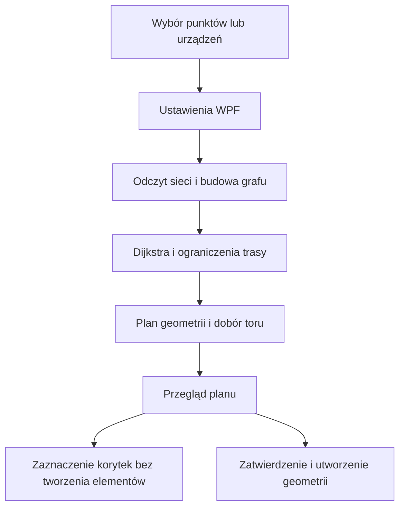

# RoutingCore · Revit Route Lab

**Wyznaczanie tras instalacyjnych w modelu BIM — C#, algorytmy grafowe i integracja z Autodesk Revit.**

Revit Route Lab zamienia sieć korytek kablowych w graf, wyszukuje trasę między wskazanymi punktami lub urządzeniami i przygotowuje geometrię rur osłonowych (*conduitów*). Uwzględnia połączenia między elementami, dopuszczalne przerwy w sieci oraz miejsce zajęte przez istniejące conduity.

Projekt pokazuje zastosowanie C# do problemu inżynierskiego: od odwzorowania danych modelu i doboru algorytmu, przez obliczenia geometryczne, po interfejs użytkownika i zapis elementów przez API aplikacji desktopowej.

**Technologie:** C# · .NET 8 · .NET Framework 4.8 · WPF / XAML · Revit API · LINQ · Newtonsoft.Json · PowerShell

[Najważniejsze fragmenty kodu](#co-pokazuje-kod) · [Architektura](#architektura) · [Testy bez Revita](#sprawdź-algorytm-bez-revita) · [Uruchomienie](#uruchomienie-w-revicie)

## Problem, który rozwiązuje

Najbliższe korytko nie musi prowadzić do celu. Najkrótsza droga w linii prostej może przecinać przerwę w sieci, a poprawna ścieżka po korytkach wymaga jeszcze wyznaczenia miejsca na conduit w ich przekroju.

Dodatek łączy te etapy w jeden proces: odczytuje połączenia, porównuje koszty dostępnych dróg, planuje odcinki i przedstawia wynik przed utworzeniem conduitów. Użytkownik może obejrzeć długość trasy i ostrzeżenia, zaznaczyć wykorzystane korytka albo zatwierdzić utworzenie geometrii.

Przykładowy scenariusz: wskazanie dwóch urządzeń, znalezienie połączonych korytek w ich otoczeniu, wyznaczenie drogi przez sieć i opcjonalne dodanie zejść do urządzeń. Jeżeli trasa musi przejść przez konkretne korytko, można narzucić ten warunek podczas wyszukiwania.

## Co pokazuje kod

| Obszar | Rozwiązanie w projekcie | Przykład implementacji |
| --- | --- | --- |
| **Algorytmy i struktury danych** | Dijkstra na grafie ważonym; `Dictionary`, `SortedSet` i własne komparatory do przechowywania kosztów, wyboru kolejnego stanu i rozstrzygania remisów. | [ConduitPathfinder.cs](src/RevitRouteLab/Modules/ConduitManager/Services/ConduitPathfinder.cs) |
| **Modelowanie w C#** | Stan wyszukiwania jako `readonly struct` z `IEquatable<T>`; modele krawędzi, planu wykonania i raportu oddzielają dane od operacji na dokumencie. | [ConduitExecutionPlan.cs](src/RevitRouteLab/Modules/ConduitManager/Models/ConduitExecutionPlan.cs), [TrayGraphEdge.cs](src/RevitRouteLab/Modules/ConduitManager/Models/TrayGraphEdge.cs) |
| **Geometria i ograniczenia przestrzenne** | Dobór toru w przekroju korytka z uwzględnieniem średnicy, odstępów oraz istniejących conduitów; kontekst zajętości przechowuje również rezerwacje planowanych osi. | [ConduitPositionAllocator.cs](src/RevitRouteLab/Modules/ConduitManager/Services/ConduitPositionAllocator.cs), [ConduitAllocationContext.cs](src/RevitRouteLab/Modules/ConduitManager/Services/ConduitAllocationContext.cs) |
| **Integracja z API** | Odczyt konektorów i elementów modelu, budowa sieci, tworzenie geometrii w transakcji oraz obsługa wyjątków i wycofania operacji. | [TrayNetworkCollector.cs](src/RevitRouteLab/Modules/ConduitManager/Services/TrayNetworkCollector.cs), [ConduitRoutingService.cs](src/RevitRouteLab/Modules/ConduitRouting/Services/ConduitRoutingService.cs) |
| **Aplikacja desktopowa** | Okno ustawień WPF, graficzny podgląd przekroju, polecenia `IExternalCommand` i wspólna obsługa anulowania oraz przeglądu planu. | [ConduitRoutingSettingsWindow.xaml](src/RevitRouteLab/Modules/ConduitRouting/Views/ConduitRoutingSettingsWindow.xaml), [RoutingCommands.cs](src/RevitRouteLab/Commands/RoutingCommands.cs) |
| **Weryfikacja algorytmów** | Scenariusze brzegowe i porównanie wyników na losowych grafach z niezależną implementacją Floyda–Warshalla. | [Program.cs — testy algorytmu](tests/Routing.AlgorithmChecks/Program.cs) |

### Trzy istotne decyzje projektowe

**Wymuszone korytko jest częścią stanu wyszukiwania.** Stan zawiera klucz węzła i informację, czy wymagana krawędź została już przebyta. Pozwala to znaleźć najtańszą drogę spełniającą warunek; samo dotknięcie konektora wskazanego korytka nie wystarcza.

**Dobór końców trasy uwzględnia koszt przejścia przez sieć.** Metoda `ComputeDistances` wyznacza koszty do wszystkich osiągalnych węzłów w jednym przebiegu. [Usługa doboru końców](src/RevitRouteLab/Modules/ConduitManager/Services/ConduitAutomaticEndpointLocatorService.cs) wykorzystuje te wyniki przy ocenie kandydatów. Dopuszczalne mostki nad przerwami mają dodatkowy koszt, dzięki czemu mogą być porównywane z objazdem po połączonych korytkach.

**Planowanie jest oddzielone od tworzenia elementów.** `ConduitExecutionPlan` przechowuje geometrię, ustawienia i raport. Polecenia trasowania conduitów najpierw przygotowują plan, następnie pokazują go użytkownikowi, a po zatwierdzeniu przekazują do wykonania w transakcji Revita.

## Architektura

Przepływ dla wyznaczania trasy conduitu:



```text
src/RevitRouteLab/
├── Application.cs              # Karta i przyciski dodatku
├── Commands/                   # Polecenia i przebieg interakcji
└── Modules/
    ├── ConduitManager/         # Graf, wyszukiwanie, geometria, przydział torów
    ├── ConduitRouting/         # Ustawienia WPF i wykonanie planu
    └── AutoTrayRouting/        # Planowanie dojść i tworzenie połączeń korytek
tests/Routing.AlgorithmChecks/  # Konsolowa weryfikacja algorytmu
scripts/                       # Kompilacja, pakowanie, instalacja
docs/                          # Architektura i wyniki weryfikacji
```

Projekt jest samodzielnym dodatkiem z własną biblioteką `RevitRouteLab.dll`, identyfikatorem i procesem budowania. Kod używa przestrzeni nazw `RevitRouteLab.*`. Granice modułów i ich odpowiedzialności opisuje [mapa architektury](docs/ARCHITECTURE.md).

## Sprawdź algorytm bez Revita

Do uruchomienia testów wystarczy .NET SDK obsługujący .NET 8. Z katalogu repozytorium:

```powershell
dotnet run --project .\tests\Routing.AlgorithmChecks -c Release
```

Zestaw weryfikacyjny wykonał **15 188 asercji**, obejmujących scenariusze brzegowe oraz **100 losowych grafów** z ustalonym ziarnem generatora. Sprawdza m.in. koszt i ciągłość ścieżki, kierunki krawędzi, brak połączenia, remisy, cykle o zerowym koszcie, wymuszone korytko i koszt mostka.

Testy kompilują bezpośrednio kod grafu i wyszukiwania używany przez dodatek. Minimalne zastępniki typów Autodesk pozwalają wykonać obliczenia poza Revitem. Zakres tych testów obejmuje logikę grafową; geometria i transakcje wymagają osobnej weryfikacji w aplikacji.

## Uruchomienie w Revicie

Wymagania: Windows, .NET SDK, Revit odpowiedniej wersji lub jego biblioteki API. Dla Revita 2024 potrzebny jest również .NET Framework 4.8 Developer Pack. Zależności NuGet są odtwarzane podczas budowania.

| Wersja Revita | Platforma | Zweryfikowany etap |
| --- | --- | --- |
| 2024 | .NET Framework 4.8 | Kompilacja i przygotowanie paczki |
| 2025 | .NET 8 / Windows | Kompilacja i przygotowanie paczki |

```powershell
# Zbuduj dodatek dla wybranej wersji
.\scripts\Build.ps1 -RevitVersion 2024

# Po zamknięciu Revita zainstaluj przygotowaną paczkę
.\scripts\Install.ps1 -RevitVersion 2024
```

Dla Revita 2025 użyj `-RevitVersion 2025`. Niestandardową lokalizację API można przekazać przez `-RevitApiPath 'D:\RevitAPI\2024'`. Paczki są generowane do `artifacts/Revit<rok>` i pomijane przez Git. Samo budowanie nie instaluje dodatku.

Po instalacji karta **Route Lab** udostępnia pięć poleceń:

- **Między punktami** — trasa między punktami na prostych korytkach.
- **Przez korytko** — trasa z obowiązkowym przejściem przez wskazany odcinek.
- **Między urządzeniami** — automatyczny dobór końców trasy, z opcjonalnymi zejściami.
- **Conduit w korytkach** — tworzenie conduitu w wybranych korytkach i kształtkach.
- **Auto korytka** — tworzenie korytek, conduitów lub obu dla dwóch zaznaczonych elementów źródłowych. Ten moduł ma osobny przebieg i uruchamia tworzenie bez przeglądu planu.

## Status i zakres

W repozytorium znajdują się wyniki kompilacji i testów algorytmicznych. Uruchomienie dodatku wewnątrz Revita pozostaje do zweryfikowania według [scenariuszy ręcznych](docs/REVIT-SMOKE-TESTS.md). Szczegółowy [raport walidacji](docs/VALIDATION.md) opisuje również ostrzeżenia kompilatora i zgodność z API.

Trasowanie działa na sieci korytek aktywnego dokumentu. Wyszukiwanie wykorzystuje **algorytm Dijkstry**; przydział torów uwzględnia zajętość conduitami, ale projekt nie zapewnia ogólnego omijania wszystkich przeszkód budowlanych. Revit 2026 wymaga migracji obsługi identyfikatorów elementów i obecnie nie jest obsługiwany.
